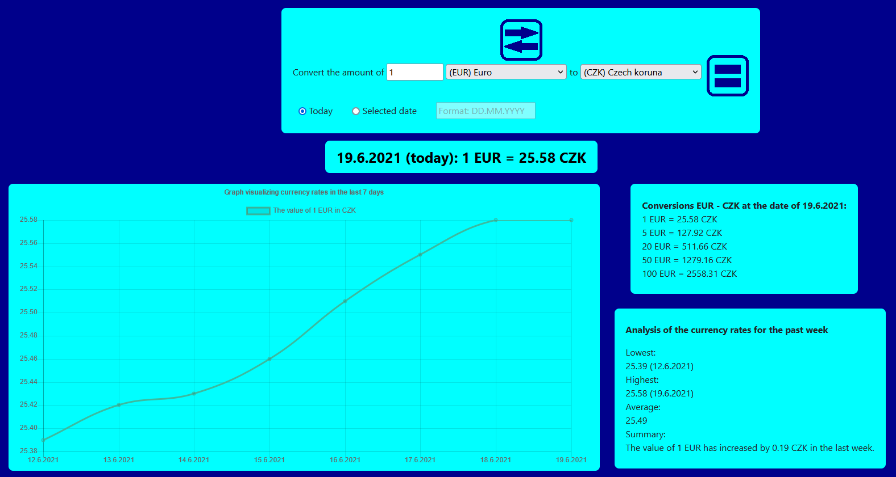

# Currency converter
 A simple browser-based currency converter using API to fetch current currency rates and JavaScript to compute various calculations.
 
 Features & description:
 - Allows conversions between 20 currencies. The list of included currencies is not equal to the world's most tradable currencies but is rather a list of currencies most relevant to an average person from central Europe.
 - Free API is used to fetch current currency rates. Initially, only API from [currencyconverterapi.com](https://www.currencyconverterapi.com/) was used for these purposes, but unfortunately the provided API is subjected to downtimes. Which is why the repository includes an additional file script-alternative-api.js, which used API from another website, [exchangeratesapi.io](https://www.exchangeratesapi.io/). The advantage of the first API is that it updates currency rates during the weekend. Its disadvantage is (besides downtimes) that currency rates are not provided for dates older than one year. The second API provides rates as old as 20 years, so it is possible to get rid of the 1-year limit that is embedded in this project in case you are going to use the second API.
 - Shows graphical visualization of currency rates in the last week and its analysis.
 - Displays additional conversions with most common values that use the requested date and currencies.

 
